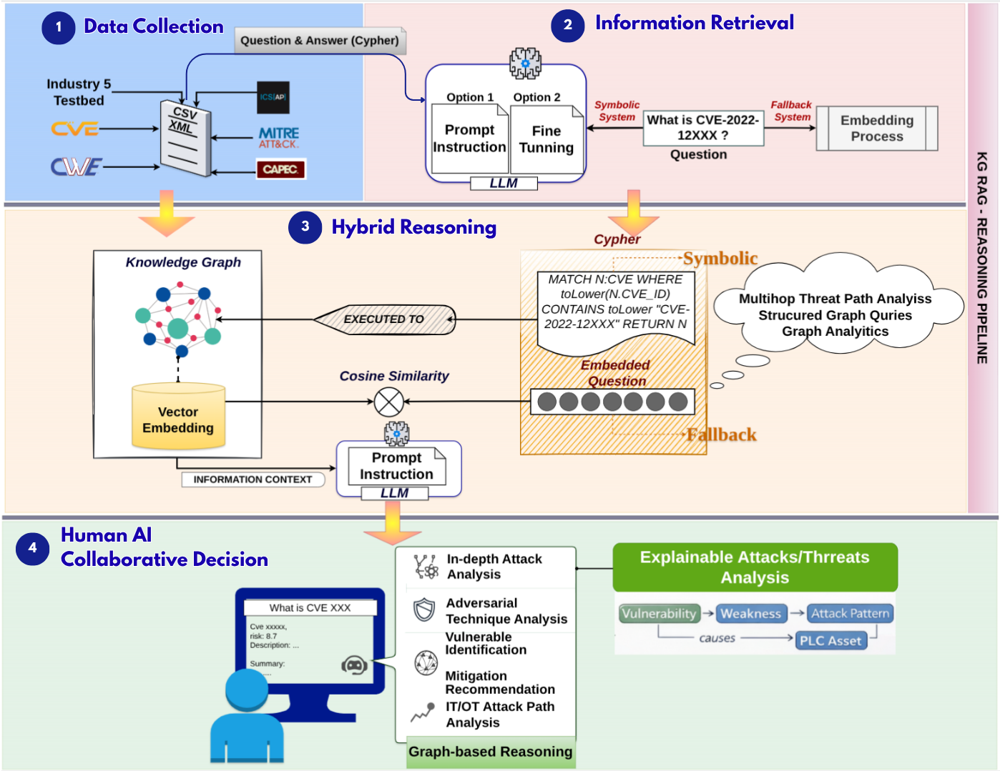

# GRICS: Graph-Integrated Cybersecurity Intelligence for Advanced Manufacturing

This repository contains **GRICS (Graph-Integrated Retrieval for Industry-Centric Security)** — a knowledge-graph-aware framework for explainable cyber threat reasoning in Industry 5.0 environments.

---

## Overview



[Download Model](https://drive.google.com/file/d/1b_6akH2ZQDOi6QzALJX4YFFYvqS5-FTB/view?usp=sharing)

GRICS is a **KG-RAG (Knowledge Graph + Retrieval-Augmented Generation)** framework designed for:

- Explainable cyber threat reasoning  
- Multi-hop attack path analysis  
- Human–AI collaborative decision support  
- Cyber-physical systems in advanced manufacturing  

It integrates structured cybersecurity knowledge (**CVE, CWE, CAPEC, MITRE ATT&CK**) with a dual-LLM architecture to enable **interpretable, ontology-grounded reasoning across IT and OT environments**.

---

## Core Contributions

- Graph-aware RAG for cyber-physical systems  
- BRIDG-ICS ontology integration  
- Dual-LLM pipeline (retrieval + answer generation)  
- Hybrid symbolic + embedding fallback retrieval  
- Multi-hop reasoning (up to 5 hops)  
- Explainability and robustness evaluation  

---

## System Architecture

### 1. Symbolic Retrieval
- Natural language → Cypher query  
- Executed on Neo4j knowledge graph  
- Returns structured, interpretable subgraphs  

### 2. Answer Generation
- Graph evidence → LLM synthesis  
- Produces grounded explanations  
- Preserves reasoning chains  
  *(e.g., CVE → CWE → CAPEC → ATT&CK)*  

### 3. Embedding Fallback
- Triggered when symbolic retrieval fails  
- Uses semantic similarity to identify anchor nodes  
- Regenerates refined Cypher queries  

---

## Knowledge Graph (BRIDG-ICS)

The BRIDG-ICS graph integrates:

- CVE, CWE, CAPEC, MITRE ATT&CK  
- Industrial assets (IT / OT)  
- Communication flows and risk attributes  

**Risk attributes include:**
- `pExploit`, `riskWeight`, `controlStrength`, `costAttack`

### Supports:
- Vulnerability Propagation Risk (VPR)  
- ATT&CK technique mapping  
- Cross-layer attack path reasoning  

---

## Evaluation

GRICS is evaluated on:

- **CTI-RCM (2021, 2024)**  
- **CTI-ATE benchmark**  
- Multi-hop reasoning (1–5 hops)  

### Metrics

- **Explainability**
  - Hallucination Rate (HR)  
  - Query Violation Rate (QVR)  
  - Schema Consistency Rate (SCR)  

- **Robustness**
  - Attack Success Rate (ASR)  
  - Tokens per Query (TPQ)  

### Key Results

- Improved multi-hop reasoning stability  
- Reduced hallucination with increasing complexity  
- Strong symbolic grounding  
- Higher interpretability than baseline LLMs  

---

## Human-Centric Design

GRICS is designed for **transparent and auditable AI-assisted analysis**:

- Inspectable reasoning chains  
- Visible Cypher queries  
- Verifiable intermediate steps  
- Evidence-grounded mitigation insights  

Supports **human-in-the-loop cybersecurity workflows** aligned with Industry 5.0.

---

## Future Work

- Adaptive and confidence-aware retrieval  
- Hierarchical reasoning strategies  
- Structural adversarial robustness evaluation  
- Real-time embedding updates  
- Integration with **digital twin systems** for dynamic risk analysis  

---

## Citation

If you use this work, please cite:

```bibtex
@article{GRICS2025,
  title={GRICS: A Human–AI Collaborative Knowledge-Graph Framework for Threat Reasoning in Advanced Manufacturing Systems},
  author={Nandiya, P. and Mohsin, A. and Sarker, I.H. and Ibrahim, A. and Janicke, H.},
  journal={IEEE},
  year={2026}
}